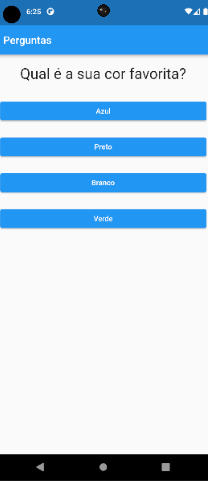
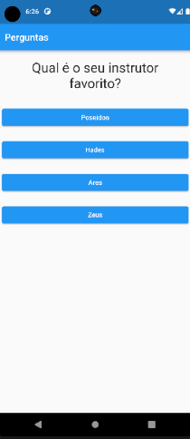
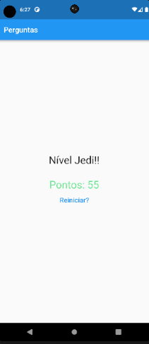

&nbsp;&nbsp;&nbsp;&nbsp;&nbsp;&nbsp;&nbsp;&nbsp;&nbsp;&nbsp;&nbsp;&nbsp;&nbsp;&nbsp;&nbsp;

# pt-br - Perguntas App

  

Projeto de estudos Flutter. 

### Curso  [Aprenda Flutter e Desenvolva Apps Para Android e IOS 2022](https://udemy.com/course/curso-flutter/)

  

## Sobre

  

App simples de perguntas e respostas, atribuindo pontuação a cada resposta e exibindo os pontos e mensagem ao final do ciclo de 3 perguntas.

  

Projeto educacional de aprendizado Flutter, alguns dos recursos aprendidos em caráter iniciante foram:

  

- Widgets(Scaffold, AppBar, Text(TextStyle), TextButton, ElevatedButton, Column, Container, Center e Widgets customizados).

- Classes, Funções, métodos e atributos. Noções de POO.

  
  

# en-US - App Questions

  

Flutter studies project.

  

## About

  

Simple question and answer app, assigning a score to each answer and displaying the points and message at the end of the 3 question cycle.

  

Flutter learning educational project, some of the resources learned at beginner level:

  

- Widgets(Scaffold, AppBar, Text(TextStyle), TextButton, ElevatedButton, Column, Container, Center and Custom Widgets).

- Classes, Functions, methods and attributes. OOP basics.
